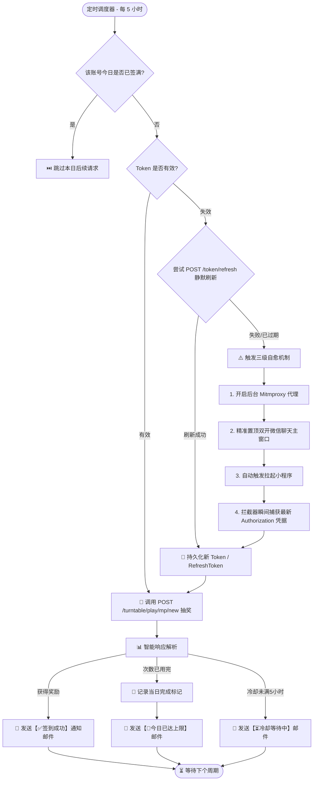

# 微信小程序双账号全自动自愈转盘签到助手 (WeChat MiniProgram Dual-Account Auto Sign-in)

> 基于 Python + 内嵌 Mitmproxy 代理 + Windows 窗口自动化的高可用全自动微信小程序签到与转盘抽奖助手。

---

## 🌟 核心特性 (Features)

- **🔄 双账号全自动循环巡检**：默认每 5 小时自动巡检执行双账号转盘签到。
- **🛡️ 零人工三级自愈机制 (Self-Healing)**：
  - **一级**：内存/本地缓存直接鉴权；
  - **二级**：Token 过期时使用 `refreshToken` 静默换取新凭证；
  - **三级**：移动端顶号/Token 彻底失效时，自动激活微信双开主窗口，模拟唤醒小程序，内嵌抓包代理秒级自动捕获最新凭证并持久化。
- **🛑 当日上限智能停签**：精准识别服务端 `今日抽奖次数已用完` 响应，自动记录当日完成标记，停止当天后续无谓请求，次日零点自动解封重置。
- **⏳ 冷却时间智能感知**：精准解析 `距离上次抽奖未满5个小时` 状态，邮件状态显示为 `⏳ 冷却等待中`，下次巡检自动补签。
- **🌐 全链路网络重试机制**：针对小程序后端接口和 QQ SMTP 邮件投递均内置 **3 次指数退避网络重试**，杜绝网络抖动造成的签到失败。
- **📧 独立 QQ 邮箱推送**：支持多账号签到结果分别独立投递至指定 QQ 邮箱（HTML 彩色卡片排版）。
- **📦 单文件免依赖打包**：支持使用 PyInstaller 打包为单个独立的 `.exe` 可执行文件，双击即可 7x24 小时后台挂机运行。

---

## 🏗️ 架构流程图 (Architecture)



---

## 🚀 快速开始 (Quick Start)

### 1. 环境准备
- 操作系统：Windows 10 / Windows 11 / Windows Server
- Python 版本：3.10 及以上
- 微信 PC 版：支持微信 3.x / 4.x 多开挂机

### 2. 安装依赖
```bash
pip install -r requirements.txt
```

### 3. 配置说明
复制 `config.example.json` 并重命名为 `config.json`（或直接在 `wechat_auto_sign.py` 中配置）：
```json
{
  "app_id": "wx44a67f9e199a46d0",
  "shop_id": 4,
  "proxy_port": 8888,
  "smtp": {
    "enabled": true,
    "smtp_server": "smtp.qq.com",
    "smtp_port": 465,
    "use_ssl": true,
    "sender_email": "your_email@qq.com",
    "auth_code": "your_qq_smtp_authorization_code",
    "receiver_email": "your_email@qq.com"
  }
}
```

### 4. 运行脚本
```bash
python wechat_auto_sign.py
```

### 5. 单文件 exe 打包 (可选)
```bash
pyinstaller -F wechat_auto_sign.py --name "wechat_auto_sign" --clean --noconfirm
```
打包完成后即可将 `dist/wechat_auto_sign.exe` 单独部署到任意 Windows 服务器挂机。

---

## 🔒 隐私与安全建议
- 绝不要将含有真实邮箱授权码、Token 或手机号的 `accounts_data.json` / `config.json` 上传至公开仓库。
- 本项目已预置完善的 `.gitignore` 规则以保护个人凭证安全。

---

## 📄 License
MIT License
